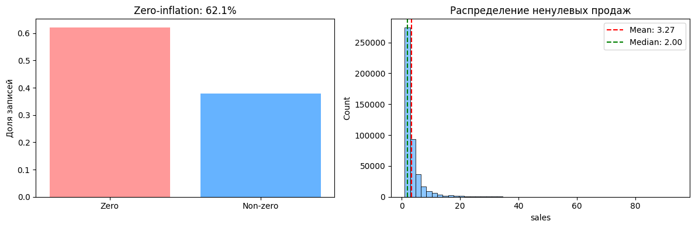
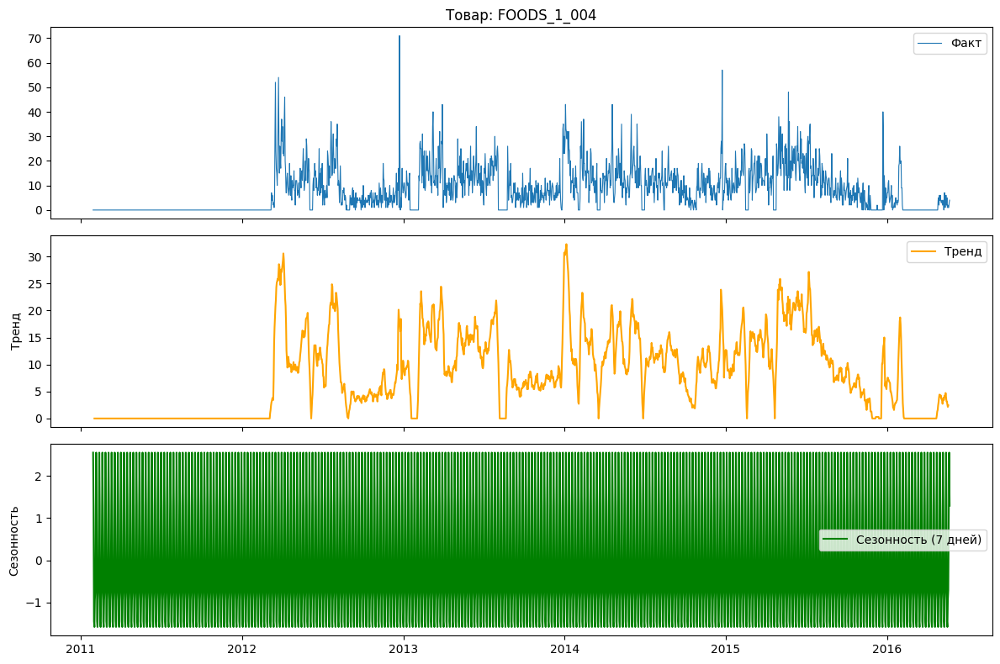
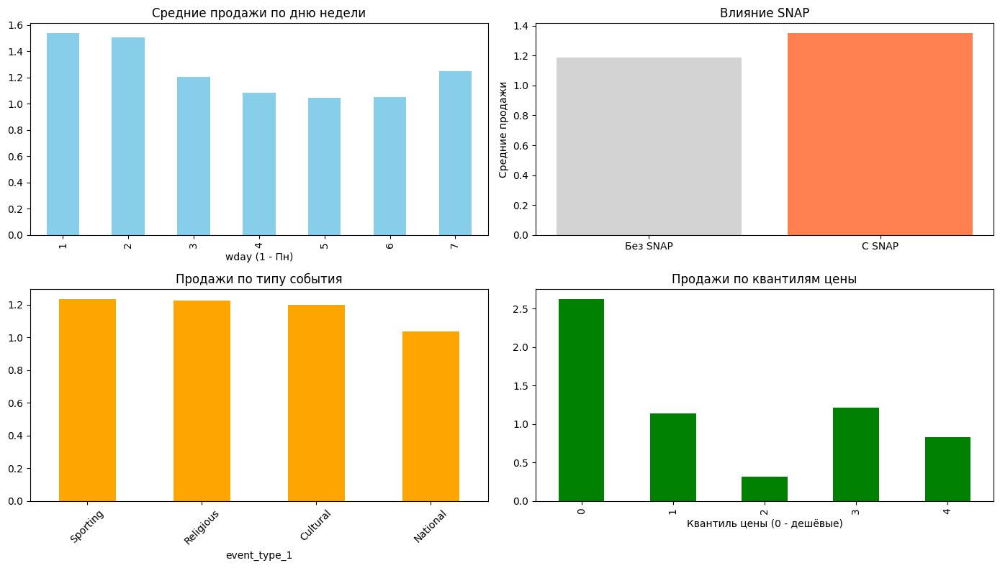
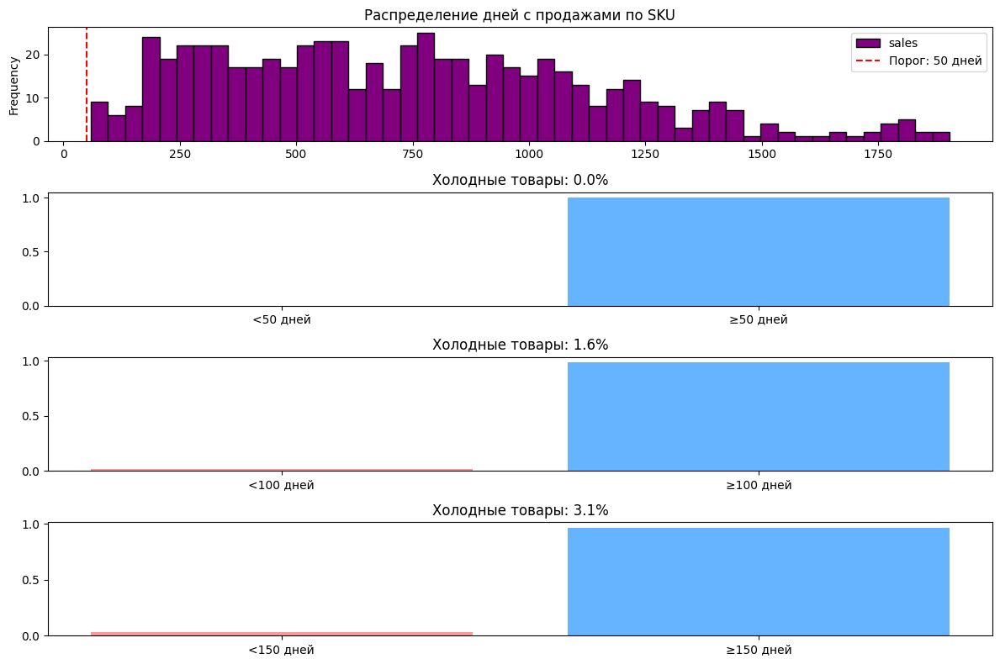
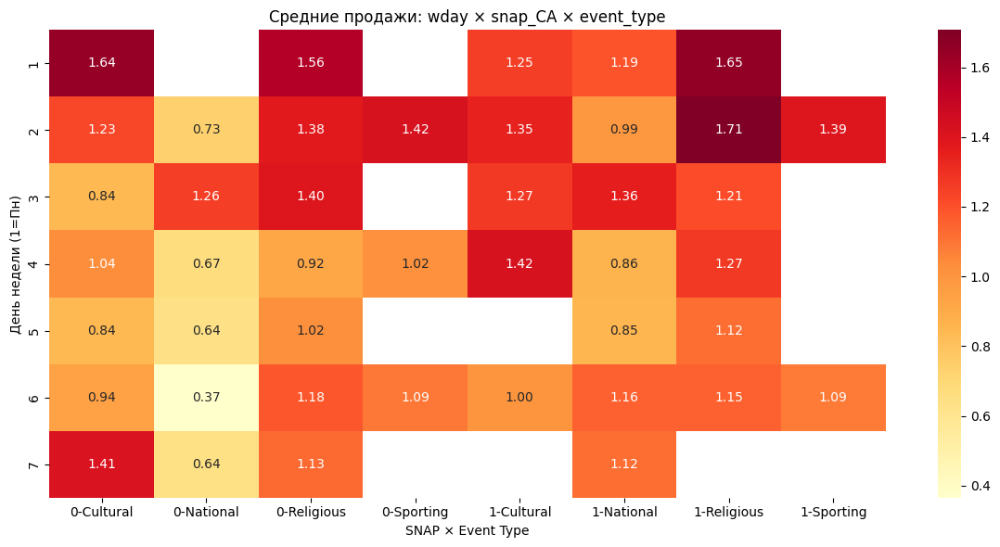
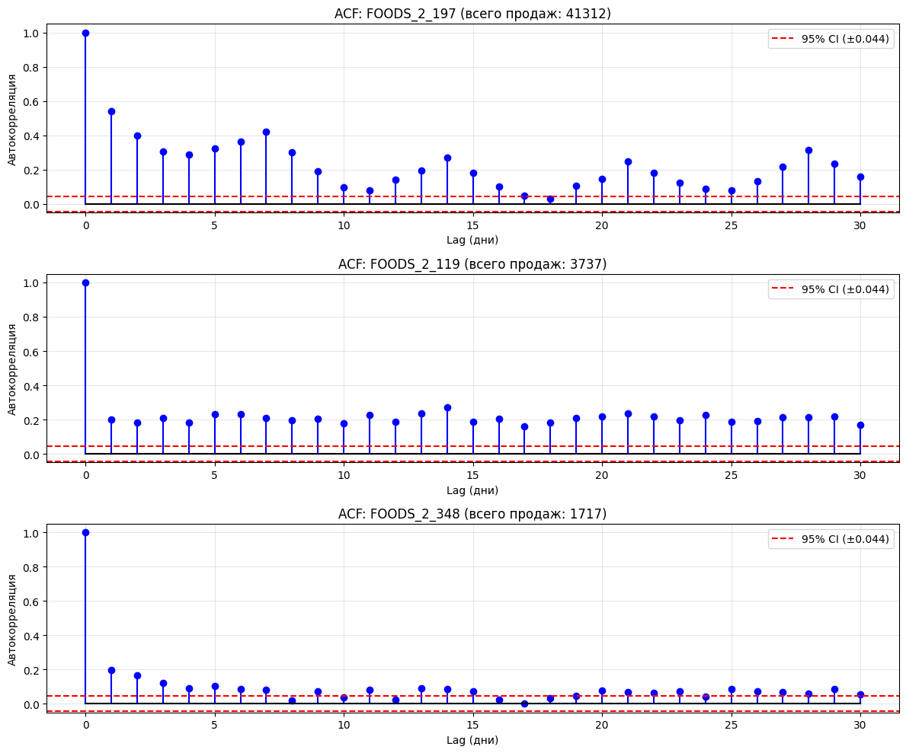

## 1. Источники и состав данных

### Источник данных
**M5 Forecasting — Accuracy** (Walmart, Kaggle)  
[https://www.kaggle.com/competitions/m5-forecasting-accuracy](https://www.kaggle.com/competitions/m5-forecasting-accuracy)

**Описание**: 
Публичный датасет, который использовался в соревновании по решению задачи прогнозирования M5 - как можно точнее оценить точечные прогнозы объёмов продаж в штуках для различных товаров, продаваемых Walmart в США.
В датасете описана история продаж 3 049 товаров в 10 магазинах сети Walmart (штаты CA, TX, WI) за период 5 лет (январь 2011 — июнь 2016).
Данные предоставлены в формате ежедневных продаж с детализацией до уровня `item_id × store_id × day`.

---

В calendar.csv временной диапазон:
- Первый день: `2011-01-29`
- Последний день: `2016-06-19`
- Всего дней: `1 969`

В файле calendar.csv представлена информация по мероприятиям и праздникам. Это достаточно значимый признак, который влияет на спрос.
У нас 30 уникальных `event_name_1`, которые относятся к 4 категориям `event_type_1` (Religious (55), National (52), Cultural (37), Sporting (18)).
`event_name_2` появляется только при пересечении двух событий в один день - всего 5 случаев, но я бы оставил этот признак, так как предполагаю, что в дни сдвоенных праздников продажи могут значимо увеличиваться.

Также присутствуют **SNAP-индикаторы**: `snap_CA`, `snap_TX`, `snap_WI` — бинарные флаги дней выплат по программе продовольственной помощи (Supplemental Nutrition Assistance Program) в 3 штатах.
Каждый штат: 650 дней с SNAP (33% периода).
Пересечения: CA+TX=390, CA+WI=390, TX+WI=455, все три=260 дней

---

В датасете M5 представлены два файла с историей продаж: `sales_train_validation.csv` (1 913 дней: d_1 – d_1913) и `sales_train_evaluation.csv`(1 941 день: d_1 – d_1941).

Работа будет проводиться по sales_train_evaluation.csv, так как:
- в нем больше данных для обучения моделей временных рядов;
- не участвуем в лидерборде Kaggle, поэтому можно не следовать их сплиту. Вместо этого определим собственный временной сплит, исходя из задачи прототипа.

Файл `sales_train_validation.csv` не используется в прототипе, но может быть полезен для кросс-валидации или сравнения с результатами участников соревнования в будущем.

Статистики sales_train_evaluation:
Размер датасета - (30 490, 1 947), 3 049 уникальных товаров, 1 941 день в истории продаж и 6 ID-колонок.
Есть информация по 10 магазинам из 3 штатов: 4 в Калифорнии (CA_1–CA_4), 3 в Техасе (TX_1–TX_3), 3 в Висконсине (WI_1–WI_3).
Есть 3 категории товаров: FOODS (47%), HOUSEHOLD (34%), HOBBIES (19%) и 7 подкатегорий FOODS_1/2/3, HOUSEHOLD_1/2, HOBBIES_1/2.

Если посмотреть конкретно по продажам, то можно выявить вот такие результаты:
- нулевые продажи - 68%, поэтому модель должна быть устойчива к нулям;
- средние ненулевые продажи - 3.53 единицы/день;
- SKU с <50 днями продаж - 282 (0.9%)
- SKU с <200 днями продаж - 5 337 (17.5%)

Также можно посмотреть на топ 5 продаж за день:

| item_id         | store_id  | max_daily_sales |
|-----------------|-----------|-----------------|
| FOODS_3_090     | CA_3      | 763.0           |
| FOODS_3_785     | CA_1      | 648.0           |
| FOODS_2_285     | TX_1      | 634.0           |
| HOUSEHOLD_2_062 | TX_1      | 601.0           |
| FOODS_3_090     | CA_1      | 599.0           |

Можно заметить, что это товары с долгим сроком хранения либо без конкретного срока. 

---

Перейдем к `sell_prices.csv`

Диапазон цен на товары варьируется от $0.01 до $30.98, а всего уникальных цен - 750.

| Параметр   | Значение  | Вывод для модели                                                                    |
|------------|-----------|-------------------------------------------------------------------------------------|
| Медиана    | $3.62     | Типичный товар стоит $3–4                                                           |
| Среднее    | $4.55     | Можно заметить правый хвост (среднее > медианы), об этом свидетельствует и диапазон |
| Мода       | $1.98     | Самый частый ценовой сегмент — бюджетные товары                                     |

Также проверено, что около 70% товаров меняют цену со временем. Цена не константа, а динамический признак. Для нашего сабсета надо будет проверить, насколько часто меняются цены на скоропорт.

---

### Файл `sample_submission.csv`

Размер файла (60 980, 29) - 30 490 рядов × 28 дней прогноза + колонка `id`
Этот датасет для обучения использоваться не будет, так как он не содержит исторических данных. Это шаблон для заполнения прогнозов.
Применяться будет собственный сплит, поэтому на данном этапе вывод в формате соревнования не потребуется.

---

## 2. Формирование сабсета для прототипа

Для проверки гипотезы о влиянии асимметричной функции потерь на прогнозирование скоропортящихся товаров нужно выделить целевой сабсет по трём критериям:

#### 1. Выбор категории: `FOODS_1` и `FOODS_2` - скоропортящиеся товары

**Обоснование**:

| Подкатегория | Примеры товаров (по документации M5 и отраслевым знаниям)   | Типичный срок годности   | Почему скоропорт                                          |
|--------------|-------------------------------------------------------------|--------------------------|-----------------------------------------------------------|
| **FOODS_1**  | Молочная продукция, яйца, йогурты, сыры                     | 5–14 дней                | Высокий риск порчи при over-forecasting                   |
| **FOODS_2**  | Мясо, птица, овощи, фрукты, замороженные продукты           | 3–10 дней                | Критична точность прогноза: ошибка = списания или дефицит |
| FOODS_3      | Консервы, бакалея, напитки, снеки                           | 6–24 месяца              | Долгохран: цена ошибки ниже, асимметрия менее критична    |

>  *Примечание: Официальная документация M5 не раскрывает конкретные товары внутри `dept_id`. Классификация основана на:*
> 1. *Типичной структуре ассортимента продуктового ритейла в США*
> 2. *Отраслевых бенчмарках сроков годности (источники: публикации McKinsey, RELEX, отраслевые форумы)*
> 3. *Логическом исключении: FOODS_3 — наиболее вероятная категория для долгохрана*

#### 2. Выбор магазина

Для прототипа нет необходимости использовать все штаты или все магазины. Данных достаточно много - это лишь замедлит разработку.
Для сабсета будем использовать данные из магазина CA_1 в Калифорнии по двум категориям товаров - FOODS_1 и FOODS_2.
После выделения получаем 614 временных ряда длиной в 1 941 день.

#### 3. Выбор фич и ковариат

Из `sales_train_evaluation.csv` нам потребуются `item_id`, `dept_id`, `cat_id`, `store_id`, `state_id`, `d_1`–`d_1941`.
Из `calendar.csv`: `date`, `wday`, `month`, `year`, `d`, `event_name_1`, `event_type_1`, `event_name_2`, `event_type_2`, `snap_CA`.
Из `sell_prices.csv` возьмем `store_id`, `item_id`, `wm_yr_wk`, `sell_price`.

В сабсете нужно перейти из Wide формата в Long, то есть чтобы 1 строка - 1 товар в 1 день.
Затем для каждой строки продаж необходимо добавить признаки этого дня. Также учесть, что в M5 цены не ежедневные, а еженедельные - одна цена применяется к 7 дням.

После форматирования и объединения получаем датасет размером (1191774, 17). Пропусков по столбцу sales нет, однако есть аж 211715 в столбце sell_price.
Предполагаю, что некоторые товары вводились/снимались с продажи в середине периода.
Некоторые статистики:
- среднее покрытие цен - 82.2%;
- товаров с покрытием <90% - 253;
- пропуски по периодам убывают со временем;
- доли пропусков по подкатегориям: FOODS_1 - 0.146192, FOODS_2 - 0.194718.

---

## 3. Визуальный EDA сабсета

После первичного EDA можно выделить следующие моменты:
- 62.1% записей имеют нулевые продажи,
- медиана меньше среднего, также заметен достаточно большой правый хвост распределения;
- при среднем 3.27 и медиане 2.00 значение максимальных продаж 94;
- на примере FOODS_1_004 можно заметить, что товар был введен в ассортимент только к середине 2012 года, затем активные продажи, но с частыми нулями и пиками;
- тренд продаж нестабильный - от быстрого роста после введения в ассортимент до явного спада и возможного вывода из него в 2016 году;
- товар имеет жизненный цикл, поэтому стоит избегать усреднения паттернов, чтобы модель могла уловить динамику;
- на графике сезонности можно проследить четкий 7-дневный цикл - недельная сезонность, амплитуда небольшая (+-1.5);
- пики продаж приходятся на понедельник и вторник - затем спад и небольшой подъем в воскресенье. Предполагаю, что это связано с нормой разовых недельных закупок в USA, когда за один поход в магазин семьи закупаются продуктами на неделю/месяц;
- также пики продаж в начале недели могут означать время пополнения запасов скоропортящихся продуктов, с чем связано желание покупателей закупиться свежими товарами;
- ошибки в дни пиковых продаж приведут к максимальным потерям;
- в дни snap_CA средние продажи растут на 12.5% - государственные программы предсказуемо ведут к повышению спроса;
- продажи по типу событий распределены равномерно - только National события показывают спад. Не все праздники одинаково полезны для продаж скоропорта - National могут смещать спрос на другие категории;
- цена товаров влияет на продажи, заметна сильная неравномерность - средний квантиль пользуется наименьшим спросом, когда самый дешевый превосходит показатели в 2.5 раза. Однако после середины заметен скачок и очередное падение для более дорогих категорий;
- гистограмма распределения показывает, что большинство товаров имеют историю от 200 до 1500 дней - датасет зрелый, товары присутствуют в ассортименте стабильно, нет массового вывода/ввода позиций в середине периода;
- все товары в сабсете имеют больше 50 дней с ненулевыми продажами, 1.6% не имеют 100 дней, а 3.1% - 150-ти - проблема «холодного старта» отсутствует;
- тренды категорий стабильны, нет резких обвалов/скачков - можно безопасно обучать на исторических данных, использовать временной сплит.

По оси X - день недели, по оси Y - комбинация статуса snap (0/1) и типа события Cultural, National, Religious, Sporting). 

Можно заметить, что внутринедельный цикл доминирует и понедельник со вторником продолжают показывать самые высоке значения. SNAP усиливает спрос, но не равномерно.
Максимальный результат получен в комбинации SNAP=1 + Religious + Вторник - 1.71, минимальный: SNAP=0 + National + Суббота - 0.37.

Для 3 репрезентативных товаров (высокий/средний/низкий спрос) рассчитана автокорреляционная функция (ACF) с 95% доверительным интервалом. Лаги за пределами этого интервала считаются статистически значимыми (вероятность случайности <5%).

**Результаты**:

| Товар         | Всего продаж | Значимые лаги (первые 10)         | Недельные лаги (7, 14, 21, 28) |
|---------------|--------------|-----------------------------------|--------------------------------|
| `FOODS_2_197` | 41 312       | [1, 2, 3, 4, 5, 6, 7, 8, 9, 10]   | Все значимы!                   |
| `FOODS_2_119` | 3 737        | [1, 2, 3, 4, 5, 6, 7, 8, 9, 10]   | Все значимы!                   |
| `FOODS_2_348` | 1 717        | [1, 2, 3, 4, 5, 6, 7, 9, 11, 13]  | Все значимы!                   |

Можно отметить:
- краткосрочная память (лаги 1–10) - товары показывают значимую автокорреляцию на коротких лагах. Если продавалось вчера - вероятно, продастся сегодня. Особенно сильно для товаров с высоким спросом;
- недельная сезонность (лаги 7, 14, 21, 28) - подтверждена статистически для трех товаров с разным спросом и сохраняется даже при низком спросе;
- затухание автокорреляции - у товаров с низким спросом автокорреляция затухает быстрее, а значит для таких товаров лаги менее надежны и роль ковариат (SNAP, события, день недели) увеличится.

## 4. Оценка качества разметки «скоропортящиеся товары»

**Текущая разметка**: эвристическая классификация по `dept_id` (`FOODS_1`, `FOODS_2`).

Официальная документация M5 не раскрывает конкретные товары внутри подкатегорий, поэтому классификация основана на отраслевых бенчмарках, а не на явных сроках годности.

**Предложения по повышению качества** - эвристическая разметка достаточна для проверки гипотезы об асимметричных потерях, но в реальном проекте потребуется явная разметка сроков годности.

## 5. Алгоритм формирования выборки

**Шаги предобработки**:
1. **Загрузка и фильтрация**: `sales_train_evaluation.csv` с фильтром `state_id='CA_1'` + `dept_id in ['FOODS_1', 'FOODS_2']`;
2. **Unpivot продаж**: с wide в long format (`d_1`…`d_1941` - колонки `d`, `sales`)
3. **Слияние с ковариатами**: 
   - `calendar.csv` по ключу `d` - временные признаки, события, SNAP
   - `sell_prices.csv` по `[store_id, item_id, wm_yr_wk]` - цены (недельную частоту в дневную)

**Генерация признаков**:

| Категория          | Примеры                                              | Обоснование                                              |
|--------------------|------------------------------------------------------|----------------------------------------------------------|
| **Временные**      | `wday` (one-hot), `month`                            | Недельная сезонность (EDA показал пик в пн–вт)           |
| **Лаги и окна**    | `lag_7`, `lag_28`, `rolling_mean_7`, `rolling_std_7` | Значимые лаги, текущий уровень спроса и волатильность    |
| **События**        | `event_type_1` (one-hot), `is_top_event`             | SNAP +12.5%, события +20–23% (EDA)                       |
| **Цены**           | `sell_price`, `price_bin`                            | Нелинейная эластичность (дешёвые продаются в 2.5× лучше) |
| **Взаимодействия** | `snap_CA × wday`                                     | Синергия факторов (heatmap показал максимум 1.71)        |

Стратегия валидации для прототипа - временной сплит, чтобы избежать утечки будущего в признаки.

| Выборка        | Диапазон дней       | Назначение                               |
|----------------|---------------------|------------------------------------------|
| **Train**      | `d_1` – `d_1500`    | Обучение модели                          |
| **Validation** | `d_1501` – `d_1700` | Подбор гиперпараметров, ранняя остановка |
| **Test**       | `d_1701` – `d_1941` | Финальная оценка (имитация «будущего»)   |

Также нужно прописать `Gap=7 дней` - между train и validation введён зазор в 7 дней (горизонт прогноза), чтобы исключить утечку через лаговые признаки.
Такого варианта достаточно для прототипа, так как из EDA следует, что на уровне категорий `FOODS_1/2` структурные разрывы отсутствуют. 1500 дней истории достаточно для обучения, а фиксированный временной сплит позволяет быстро отладить пайплайн. 
Возможно после проверки гипотезы в будущем в production понадобится добавить walk-forward.
